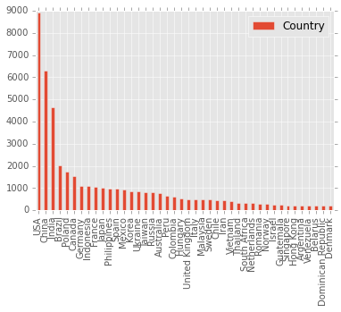
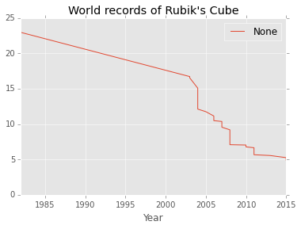

Following on the recent hype around the robot
that is able to solve a Rubik's cube [in a second](http://hackaday.com/2016/01/27/robot-solves-rubiks-cube-in-just-one-second/)
(which seems a big improvement over the previous robot that was able to
solve it in about 3 seconds), I got interested in human records, and
their evolution over the year.

The [World Cube Association](https://www.worldcubeassociation.org)
provides dataset about ranking, records, players in
Rubik's Cube competitions. They offer a [downloadable
dataset](https://www.worldcubeassociation.org/results/misc/export.html)
for data science purpose. But since it would be too easy to use a TSV
;), I'll show how we can extract data from this website, and use Pandas
get some insight.

# Players

We'll first try to explore data about results of
Worldwide competitions that we can find on [this
page](https://www.worldcubeassociation.org/results).

Let's use `requests` to fetch HTML from the URL. If you go directly on
the page, you'll see that you can select the number of results you're
interested in, countries, years, etc. All theses parameters can be
specified in the URL too. In this post, I'll use all the data (all
players, all years, all countries):


```python
import requests
r = requests.get("https://www.worldcubeassociation.org/results/events.php?eventId=333&regionId=&years=&show=All%2BPersons&single=Single")
```

Beautifulsoup will let you manipulate HTML without dealing too much with
low-level details.


```python
from bs4 import BeautifulSoup
soup = BeautifulSoup(r.text, 'html.parser')
```

You can ask him to find and extract one particular part of the HTML, in
our case it would be `table-responsive` which represents the array of
results:


```python
table = soup.find("div", {"class": "table-responsive"})
raw_lines = [
    line.contents[:5]
    for line in table.find_all("tr")
    if len(line) == 6
]
raw_lines[0]
```


> 1 | [Lucas Etter](/results/p.php?i=2011ETTE01) | 4.90 | USA | [River Hill Fall 2015](/results/c.php?i=RiverHillFall2015)
> --- | --- | --- | --- |


We get a list of `HMTL Entities` that we will process to extract the
data we need. But first, let's automate this extraction process with a
function, since every tables on this website respect the same format:


```python
from bs4 import BeautifulSoup
import requests

def get_table_raws(url, cols):
    r = requests.get(url)
    soup = BeautifulSoup(r.text, 'html.parser')
    table = soup.find("div", {
        "class": "table-responsive"
    })

    raw_lines = [
        line.contents
        for line in table.find_all("tr")
        if len(line) == cols
    ]

    return [[c.text for c in line] for line in raw_lines]
```

Since we'll have to deal with dates and timings, we could use this
little helpers to do the conversions:


```python
def extract_year_from_competition(competition):
    # Format is [name] [year]
    return int(competition.strip().rsplit(' ', 1)[-1])

def convert_timing_to_seconds(timing):
    try:
        # Try to convert directly in seconds
        return float(timing)
    except ValueError:
        try:
            # Format should be [minutes]:[seconds].[tenth]
            minutes, rest = timing.split(":", 1)
            seconds, tenth = rest.split(".", 1)
            return (
                float(minutes) * 60 +
                float(seconds) +
                float(tenth) / 100
            )
        except ValueError:
            return None
```

Let's use our helpers to extract all the data:

```python
url = "https://www.worldcubeassociation.org/results/events.php?eventId=333&regionId=&years=&show=All%2BPersons&single=Single"
clean_table = []
for rank, (_, person, timing, country, competition, _) in enumerate(get_table_raws(url, 6)):
    year = extract_year_from_competition(competition)
    timing = convert_timing_to_seconds(timing)
    clean_table.append((rank + 1, person, timing, country, competition, year))

clean_table[:5]
```


> ```python
> [(1, u'Lucas Etter', 4.9, u'USA', u'River Hill Fall 2015', 2015),
>  (2, u'Keaton Ellis', 5.09, u'USA', u'River Hill Fall 2015', 2015),
>  (3, u'Collin Burns', 5.25, u'USA', u'Doylestown Spring 2015', 2015),
>  (4, u'Feliks Zemdegs', 5.39, u'Australia', u'World Championship 2015', 2015),
>  (5, u'Mats Valk', 5.55, u'Netherlands', u'Zonhoven Open 2013', 2013)]
> ```


```python
len(clean_table)
```

> ```python
> 47465
> ```

Let's see if we can gain some insight from this dataset using Pandas:


```python
import pandas as pd
import numpy as np

df = pd.DataFrame(
    data=clean_table, 
    columns=(
        'Rank',
        'Person',
        'Timing',
        'Country',
        'Competition',
        'Year'
    ))

df.head()
```


> Rank | Person         | Timing | Country     | Competition             | Year
> ---  | ---            | ---    | ---         | ---                     | ---
> 1    | Lucas Etter    | 4.9    | USA         | River Hill Fall 2015    | 2015
> 2    | Keaton Ellis   | 5.09   | USA         | River Hill Fall 2015    | 2015
> 3    | Collin Burns   | 5.25   | USA         | Doylestown Spring 2015  | 2015
> 4    | Feliks Zemdegs | 5.39   | Australia   | World Championship 2015 | 2015
> 5    | Mats Valk      | 5.55   | Netherlands | Zonhoven Open 2013      | 2013


We see that the first entry is the *World record* by [Lucas
Etter](https://www.youtube.com/watch?v=vh0W8E4cNkQ). If you didn't see,
watch it now, it's very impressive.


```python
df["Timing"].describe()
```


> |
> --- | ---
> count | `47465.000000`
> mean  | `35.078421`
> std   | `27.492358`
> min   | `4.900000`
> 25%   | `17.350000`
> 50%   | `26.720000`
> 75%   | `43.830000`
> max   | `648.000000`

> Name: Timing, dtype: float64


We have 47465 entries. The average time of resolution in these
competitions is 35 seconds, which is actually pretty fast. The maximum,
of 648 seconds (10 minutes) seems more reasonable to me...


```python
%matplotlib inline
import matplotlib.pyplot as plt
plt.style.use('ggplot')
```

We can count the number of players for each country:


```python
country_count = df[["Country"]].apply(pd.value_counts)
country_count[:20]
```

> Country | Count
> --- | ---
> USA | 8918
> China | 6286
> India | 4659
> Brazil | 2039
> Poland | 1739
> Canada | 1526
> Germany | 1092
> Indonesia | 1090
> France | 1065
> Japan | 999
> Philippines | 993
> Spain | 977
> Mexico | 932
> Korea | 869
> Ukraine | 848
> Taiwan | 828
> Russia | 817
> Australia | 766
> Peru | 671
> Colombia | 627


No surprise, bigger countries are more represented in Rubik's Cube
competitions. It would be interesting to compare these numbers with the
actual population, to see if Rubik's Cube is more *"popular"* in some
countries.

Let's visualize the countries with more than 200 players using a barplot:


```python
country_count[country_count > 200].dropna().plot(kind="bar")
```




We can do the same for players:


```python
df[["Person"]]
    .apply(pd.value_counts)
    .apply(pd.value_counts)
```

> Number of participations | Count
> --- | ---
> 1 | 46709
> 2 | 305
> 3 | 26
> 4 | 13
> 5 | 2
> 6 | 1


It appears that the vast majority of player only *participated one
time*. And only about 0.007% participated more than once. Can we
conclude that players are more hobbyist than professional? Another
information that could be interesting is the age of the participants,
since the World Champion is very young, it would be fun to have more
insight about the average or mean age of Rubik's Cube champions.

# Records

Let's now get to the world records, and try to see how they evolve over
the years. The code is pretty similar to the previous section, so we'll
just use our generic function for table extraction:


```python
url = "https://www.worldcubeassociation.org/results/regions.php?regionId=&eventId=333&years=&history=History"
clean_table = []
for (_, single, avg, person, country, competition, _) in get_table_raws(url, 7):
    single = convert_timing_to_seconds(single.strip())
    avg = convert_timing_to_seconds(avg.strip())
    year = float(extract_year_from_competition(competition))
    clean_table.append((person, single, avg, country, competition, year))

clean_table[:5]
```


```python
[
  (u'Lucas Etter', 4.9, None, u'USA', u'River Hill Fall 2015', 2015.0),
  (u'Collin Burns', 5.25, None, u'USA', u'Doylestown Spring 2015', 2015.0),
  (u'Mats Valk', 5.55, None, u'Netherlands', u'Zonhoven Open 2013', 2013.0),
  (u'Feliks Zemdegs', 5.66, None, u'Australia', u'Melbourne Winter Open 2011',
  2011.0),
  (u'Feliks Zemdegs',
   6.18,
   None,
   u'Australia',
   u'Melbourne Winter Open 2011',
   2011.0)
]
```


```python
df = pd.DataFrame(
    data=clean_table, 
    columns=('Person', 'Single', 'Avg', 'Country', 'Competition', 'Year'))

df.head()
```


> Person | Single | Avg | Country | Competition | Year
> ---    | ---    | --- | ---     | ---         |
> 0 | Lucas Etter | 4.90 | `NaN` | USA | River Hill Fall 2015 | 2015
> 1 | Collin Burns | 5.25 | `NaN` | USA | Doylestown Spring 2015 | 2015
> 2 | Mats Valk | 5.55 | `NaN` | Netherlands | Zonhoven Open 2013 | 2013
> 3 | Feliks Zemdegs | 5.66 | `NaN` | Australia | Melbourne Winter Open 2011 | 2011
> 4 | Feliks Zemdegs | 6.18 | `NaN` | Australia | Melbourne Winter Open 2011 | 2011


```python
df = df.sort(["Year", "Single"], ascending=[True, False])
df[df["Single"].notnull()].plot(x="Year", y="Single", legend="Test")
plt.title("World records of Rubik's Cube")
```




# Last words

It would seem reasonable to conclude that *we are now on a plateau*. One think that could bring even more insight would be to compare this evolution to, say, evolution among sprinters' world records over time, etc. I guess we're hitting the same kind of limitation.

A major difference is that in Rubik's Cube, you're limited both by your fingers' dexterity, and the speed at which your brain can process information, whereas in athletics, it's more about physical performance. *I would be curious to see which one is more limiting: brain, or body*.

Another open question for me is: *how much does the final score depends on the initial configuration of the Rubik's Cube?* I know that they are able to look at it before the beginning, so maybe this is negligible, maybe not.
